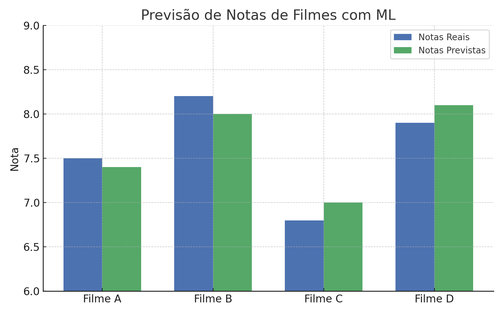

# 🎬 Previsão de Notas de Filmes com Machine Learning



Este projeto tem como objetivo aplicar técnicas de Ciência de Dados e Aprendizado de Máquina para prever a nota média de filmes com base em características como:

- Gênero
- Duração
- Orçamento
- Número de votos
- Popularidade

---

## 📌 Objetivos

### 1. Análise Exploratória dos Dados
- Explorar padrões nos dados de filmes
- Identificar relações entre variáveis
- Verificar correlações com a nota média

### 2. Modelagem Preditiva
- Aplicar modelos de Machine Learning para prever a nota dos filmes
- Comparar diferentes algoritmos para verificar o melhor desempenho

---

## ⚙️ Tecnologias e Bibliotecas Usadas

- Python 3
- Pandas
- NumPy
- Scikit-learn
- XGBoost
- Seaborn & Matplotlib
- Jupyter Notebook

---

## 🤖 Modelos Testados

- Regressão Linear
- Random Forest Regressor
- XGBoost Regressor

Com otimização de hiperparâmetros usando `GridSearchCV`.

---

## 🎯 Métricas Avaliadas

- R² (Coeficiente de Determinação)
- RMSE (Erro Quadrático Médio da Raiz)

---

## 📈 Resultados Esperados

O objetivo final é atingir um desempenho preditivo com **R² acima de 70%**, sendo útil para prever a aceitação de filmes com base em atributos objetivos antes do lançamento.

---

## 📂 Estrutura do Projeto

```
📁 Previsao_Notas_Filmes
├── projeto_previsao_notas_filmes.ipynb
├── capa_previsao_notas_filmes.png
└── README.md
```

---

## 👩🏻‍💻 Desenvolvido por

**Aline Gomes Oliveira**  
🔗 [LinkedIn](https://www.linkedin.com/in/aline-gomes-563408169/)  
💻 [GitHub](https://github.com/AlineGomesOliveira)

---
